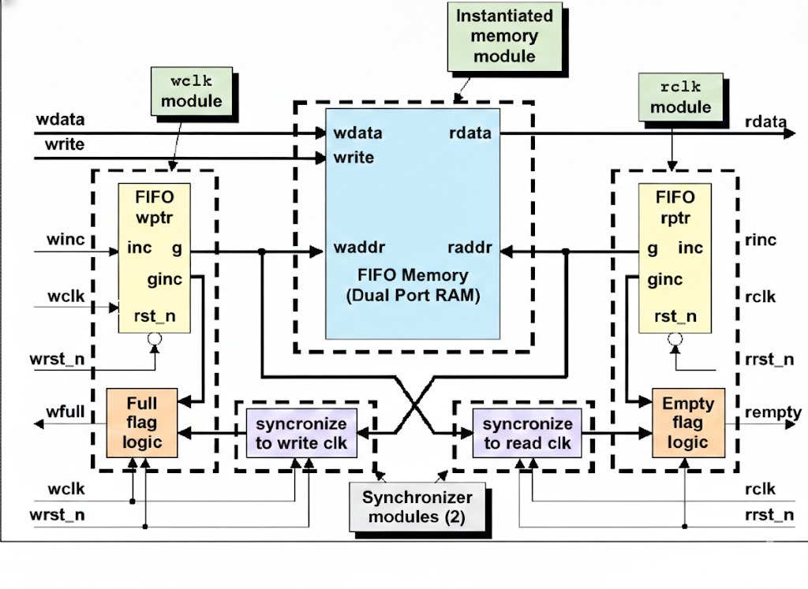
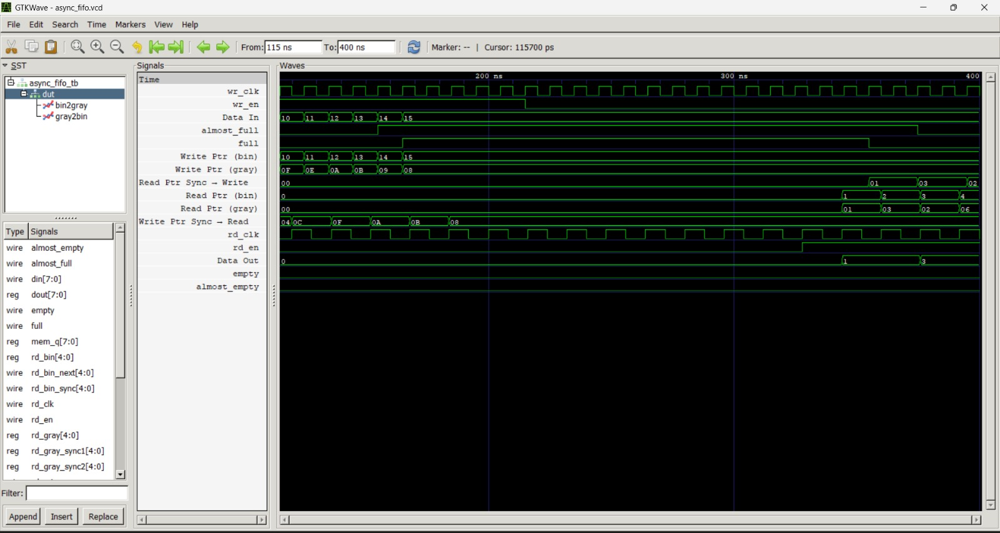

# Dual-Clock Asynchronous FIFO (Verilog)

A **Dual-Clock Asynchronous FIFO** implemented in **Verilog HDL** for safe data transfer between **two independent clock domains**.
This design follows **industry-standard Clock Domain Crossing (CDC)** practices and is suitable for FPGA-based digital systems and academic projects.

---

## 📌 Project Overview

An asynchronous FIFO enables reliable communication between subsystems running on **different clock frequencies** without data corruption.

This implementation uses:

* **Dual-Port RAM** for storage
* **Binary counters** for memory addressing
* **Gray-coded pointers** for safe clock domain crossing
* **2-Flip-Flop synchronizers** to reduce metastability risk
* **FULL / EMPTY flags** for flow control
* **ALMOST_FULL / ALMOST_EMPTY flags** for early warning

This architecture is widely used in **SoCs, communication systems, DSP pipelines, and high-speed digital designs**.

---

## 🧱 Architecture Blocks

| Block                     | Description                                        |
| ------------------------- | -------------------------------------------------- |
| **Write Pointer Handler** | Maintains write pointer in binary and Gray formats |
| **Read Pointer Handler**  | Maintains read pointer in binary and Gray formats  |
| **Dual-Port RAM**         | Stores FIFO data using binary addresses            |
| **2-FF Synchronizers**    | Safely transfer Gray pointers across clock domains |
| **Full Flag Logic**       | Detects FIFO full condition in write domain        |
| **Empty Flag Logic**      | Detects FIFO empty condition in read domain        |

---

## 🔄 FIFO Operation

### Write Clock Domain (`wr_clk`)

* `wr_en` writes `din` into FIFO memory
* Binary write pointer increments
* Binary pointer converted to Gray code
* Gray pointer synchronized into read clock domain
* `full` and `almost_full` flags generated

### Read Clock Domain (`rd_clk`)

* `rd_en` reads FIFO data into `dout`
* Binary read pointer increments
* Binary pointer converted to Gray code
* Gray pointer synchronized into write clock domain
* `empty` and `almost_empty` flags generated

---

## ⚙️ CDC Safety Techniques

| Signal Type                   | CDC Method Used                            |
| ----------------------------- | ------------------------------------------ |
| Pointer transitions           | Gray coding (only 1 bit changes at a time) |
| Cross-domain pointer transfer | 2-Flip-Flop synchronizers                  |
| Full/Empty detection          | Gray pointer comparison                    |

---

## ⚠️ Design Limitations

This FIFO is **functionally correct and CDC-safe for FPGA and educational use**, but has the following limitations:

1. **ALMOST flags are not fully CDC-clean**

   * `almost_full` and `almost_empty` convert synchronized Gray pointers back to binary
   * This can introduce small metastability risk in strict ASIC flows

2. **No ECC or parity protection**

   * Memory corruption detection is not included

3. **Depth must be power of 2**

   * Required for proper Gray code pointer wrapping

4. **Not formally verified**

   * Verified through simulation only

5. **No backpressure beyond flags**

   * System using FIFO must obey `full` and `empty` signals

---

## 🧪 Verification Method

A **self-checking testbench** is used to verify correctness.

Verification features:

* Independent write and read clocks
* Burst write and read sequences
* Scoreboard-based data integrity checking
* Pointer tracking for output validation
* Waveform inspection using GTKWave

### ✅ Verification Results

✔ No data loss
✔ No duplication
✔ Data order maintained
✔ Correct flag behavior observed

---

## 🛠 Tools Used

| Tool                     | Purpose                     |
| ------------------------ | --------------------------- |
| **Icarus Verilog**       | Simulation                  |
| **GTKWave**              | Waveform visualization      |
| **VS Code / Any Editor** | RTL development             |
| **GitHub**               | Version control and hosting |

---

## 📂 Project Structure

```
async-fifo/
│
├── rtl/
│   └── async_fifo.v
│
├── tb/
│   └── async_fifo_tb.v
│
├── waves/
│   └── async_fifo.vcd
│
├── docs/
│   ├── fifo_block_diagram.png
│   └── waveform_screenshot.png
│
└── README.md
```

---

## ▶️ How to Run Simulation

```bash
iverilog -o fifo_sim rtl/async_fifo.v tb/async_fifo_tb.v
vvp fifo_sim
gtkwave async_fifo.vcd
```

---

## 🖼 Documentation Images


| File                      | Purpose                    |
| ------------------------- | -------------------------- |
| `fifo_block_diagram.png`  | FIFO architecture overview |
| `waveform_screenshot.png` | Simulation waveform proof  |


## Architecture Diagram


## Simulation Waveform



## 📜 License

This project is released under the **MIT License**.
You are free to use, modify, and distribute this design with attribution.

---
